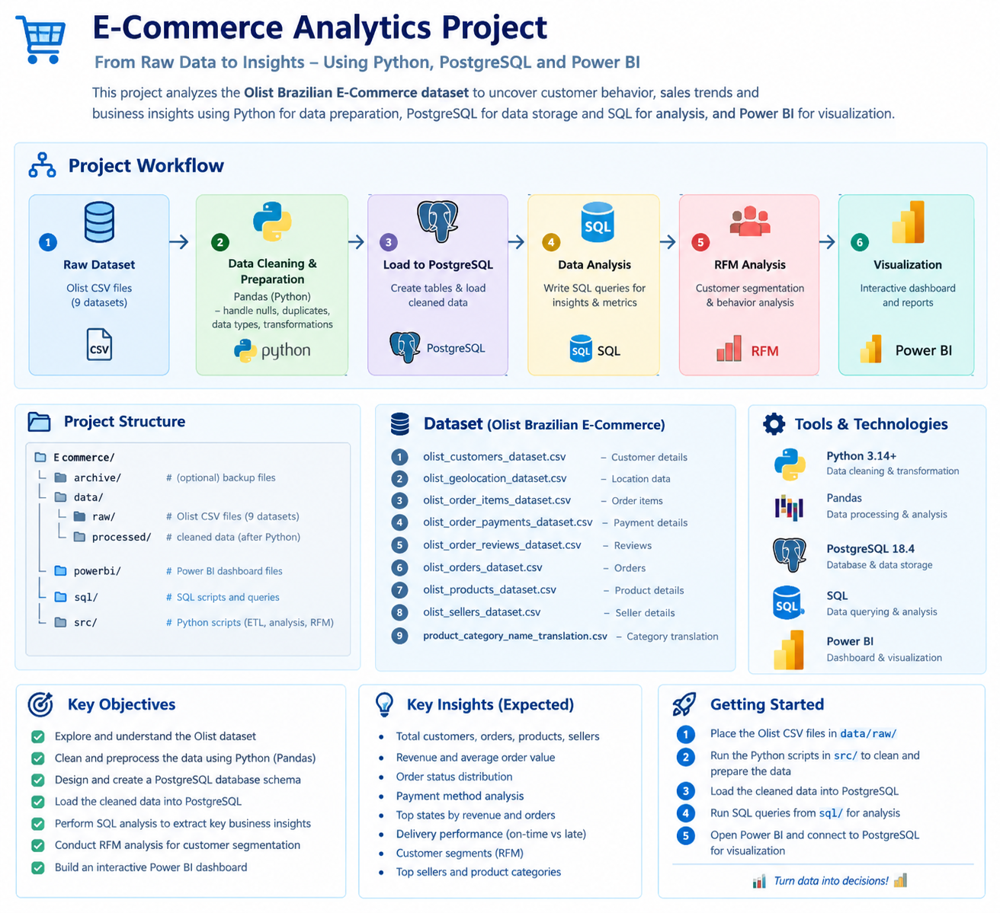

# E-Commerce Sales & Customer Analytics





## Project Overview

This project analyzes an e-commerce dataset to understand **sales performance, customer behavior, product performance, delivery efficiency, and customer satisfaction**.

The project uses Python, PostgreSQL, SQL, and Power BI to transform raw e-commerce data into business insights and an interactive dashboard.

## Objectives

- Analyze total revenue, orders, and average order value
- Identify monthly and regional sales trends
- Analyze product and category performance
- Understand customer purchasing behavior
- Identify repeat customers and customer segments
- Perform RFM (Recency, Frequency, Monetary) customer segmentation
- Analyze delivery performance and late deliveries
- Analyze customer review scores and satisfaction
- Build an interactive Power BI dashboard

## Technology Stack

| Technology | Purpose |
|---|---|
| Python | Data cleaning and analysis |
| Pandas | Data manipulation |
| PostgreSQL | Data storage and SQL analysis |
| SQL | Business and data-quality analysis |
| Power BI | Interactive visualization |
| Git/GitHub | Version control and project sharing |

## Dataset

The project uses the **Brazilian E-Commerce Public Dataset by Olist**.

The dataset contains information about:

- Customers
- Orders
- Order items
- Payments
- Products
- Sellers
- Reviews
- Geolocation
- Product category translations

## Project Workflow

```text
Raw CSV Data
     ↓
Python / Pandas
     ↓
Data Cleaning & Validation
     ↓
Cleaned CSV Data
     ↓
PostgreSQL
     ↓
SQL Analysis
     ↓
Customer / Sales / Product / Delivery Analysis
     ↓
RFM Customer Segmentation
     ↓
Power BI Data Model
     ↓
Interactive Dashboard
     ↓
Business Insights
```

## Key Analysis Areas

### Sales Analysis
- Total revenue
- Total orders
- Average order value
- Monthly revenue trends
- Revenue by state
- Revenue by product category
- Top-selling products

### Customer Analysis
- Total customers
- One-time vs repeat customers
- Customer purchase frequency
- Customer revenue contribution
- Top customers
- RFM segmentation

### Product Analysis
- Best-selling products
- Revenue by category
- Average product price
- Product performance

### Delivery Analysis
- Average delivery time
- Estimated vs actual delivery
- Late delivery percentage
- Delivery performance by region

### Customer Satisfaction
- Average review score
- Review score distribution
- Review scores by category
- Relationship between delivery performance and reviews

## RFM Analysis

RFM stands for:

- **Recency** — How recently a customer purchased
- **Frequency** — How often a customer purchased
- **Monetary** — How much a customer spent

Customers can be grouped into segments such as:

- Champions
- Loyal Customers
- Potential Loyalists
- At Risk
- Lost Customers

## Power BI Dashboard

The dashboard can contain the following pages:

### 1. Executive Dashboard
- Total Revenue
- Total Orders
- Total Customers
- Average Order Value
- Monthly Revenue
- Order Status
- Revenue by State

### 2. Product Analysis
- Revenue by Category
- Top Products
- Sales by Category
- Average Product Price

### 3. Customer Analysis
- New vs Repeat Customers
- Customer Segments
- RFM Analysis
- Top Customers

### 4. Delivery & Satisfaction
- Average Delivery Time
- On-Time vs Late Delivery
- Review Score Distribution
- Review Score vs Delivery Performance

## Project Structure

```text
E commerce/
├── archive/
├── data/
│   ├── raw/
│   ├── cleaned/
│   └── processed/
├── powerbi/
├── sql/
├── src/
├── README.md
└── requirements.txt
```

## Expected Outcome

The final project demonstrates an end-to-end analytics workflow:

**Data Collection → Data Cleaning → Database Storage → SQL Analysis → Customer Segmentation → Visualization → Business Insights**

This project can be used as a portfolio project for **Data Analyst / Data Engineer** roles.
